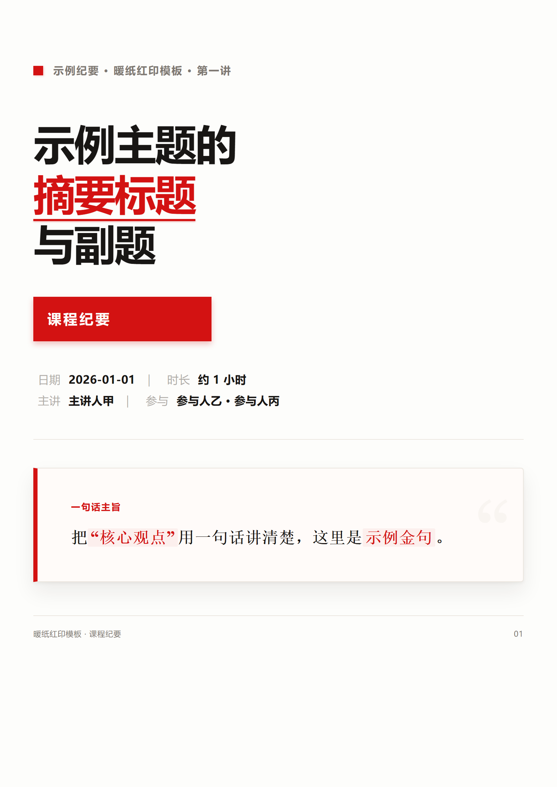
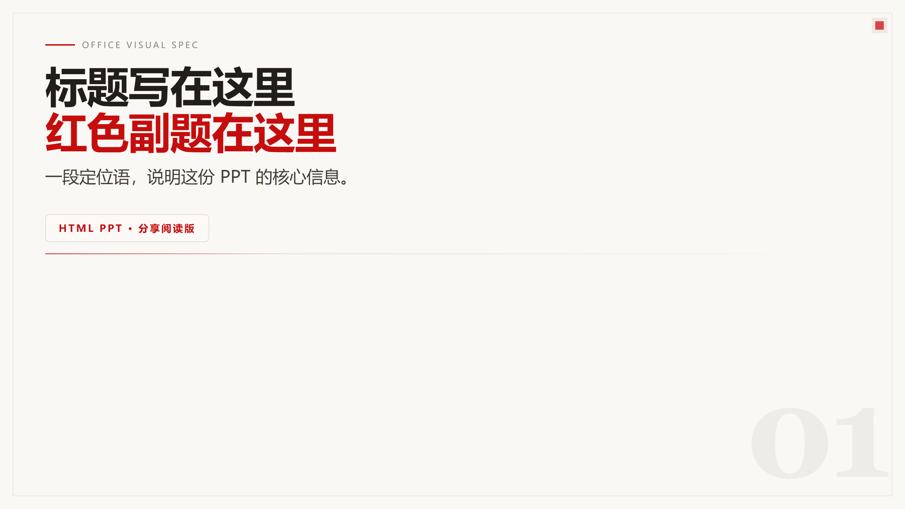
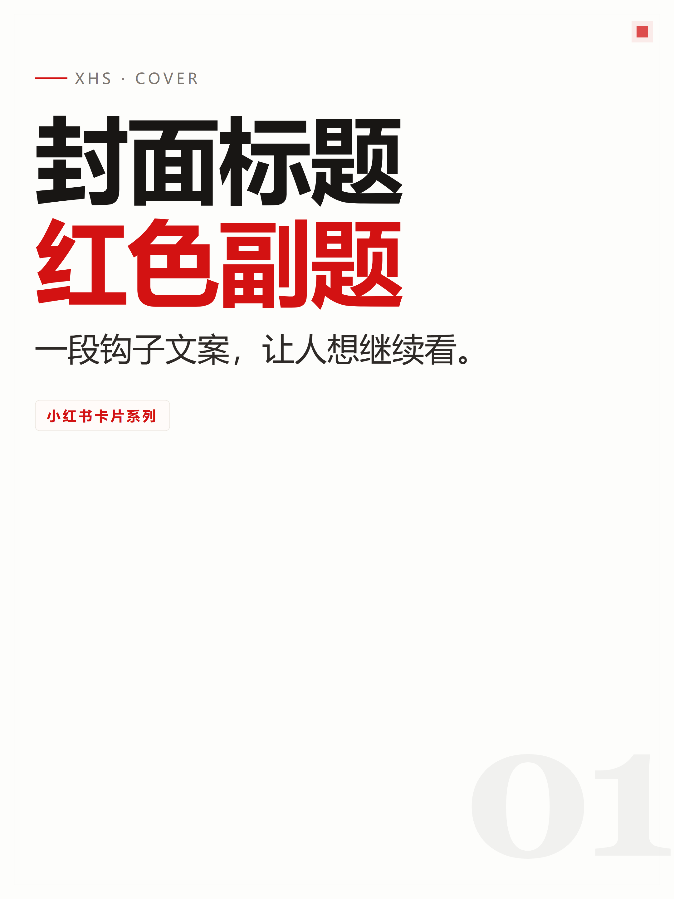
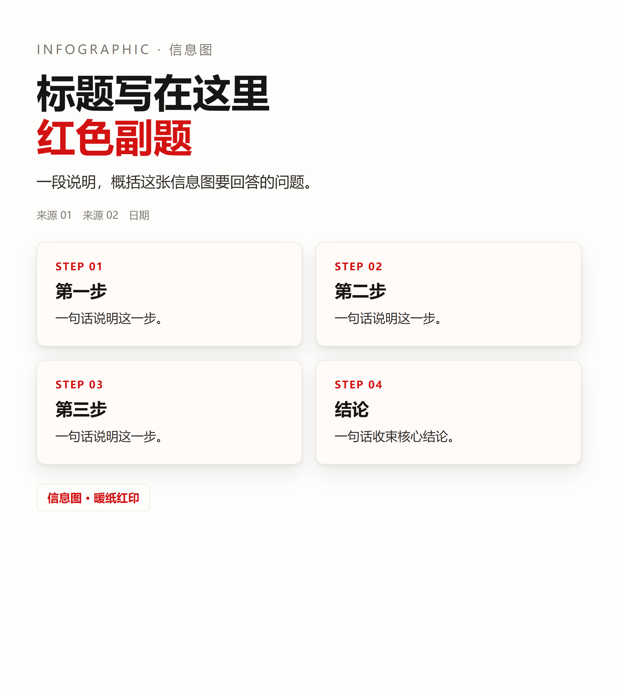

# DUDU · office-visual-spec

- 基于HTML编写把文字内容变成好看、可直接使用的视觉成品。
- 每一种都会保留可编辑的 HTML，并导出 PNG 和 PDF，方便直接使用或继续修改。
- 色调以米色红色黑色为主，极简风格。也可以发参考图进行模仿输出。
- 你只需要提供一份笔记、文章或课程内容，它能帮你生成排版整齐的 PDF、PPT、卡片、长图和网页。
- macOS 用户注意：Safari 不支持 headless 渲染，请安装 Chrome、Chromium 或 Edge；安装后运行 doctor，或用 OVS_BROWSER 指定浏览器路径。

## 它能做什么

| 成品 | 用途 |
| --- | --- |
| A4 PDF 摘要 | 论文、课程、报告整理成一页页阅读版 |
| 静态 PPT | 16:9 分享图，可导出 PDF / PNG |
| 交互网页 PPT | 在浏览器里翻页、有动效的演示页 |
| HTML 页面 | 可滚动阅读的完整文章页 |
| 小红书卡片 | 3:4 竖版系列卡片，适合发小红书 |
| 手机长图 | 1080px 宽长图，适合手机阅读 |
| 信息图 | 单张知识图，适合快速传播 |

## 适合谁

- 不想学排版，想快速把笔记 / 文章变成图的人
- 做课程资料、分享卡片、公众号 / 小红书配图的人
- 用 AI agent 自动生成和批量产出视觉内容的人

## 效果长什么样

`examples/` 文件夹里放了参考样例。以下是用本包生成的几种成品：






先看样例，再决定要生成哪一种。

## 全新电脑先装两样东西

安装脚本只负责 Python 依赖，以下两项是系统级前置，全新电脑默认没有：

- **Python 3.10+**：Windows 运行 `winget install Python.Python.3.12`（或从 https://www.python.org/downloads/ 下载）；macOS 运行 `brew install python@3.12`（没有 Homebrew 先装：https://brew.sh）。
- **浏览器**：Windows 自带 Edge，无需安装；macOS 只有 Safari，Safari 不支持本工具的无头渲染，必须装 Chrome/Edge/Chromium（`brew install --cask google-chrome`）。

安装过程可能弹出系统授权（UAC / 密码 / 钥匙串），确认一次即可。装完再走下面的安装脚本。

## 手动安装依赖

Windows：

1. 双击 `install.bat`，自动安装环境
2. 双击 `doctor.bat`，检查环境
3. 看到“全部通过”就可以开始用

macOS / Linux：

1. 运行 `bash install.sh`
2. 运行 `bash doctor.sh`
3. 看到“全部通过”就可以开始用

`doctor` 会逐项检查 Python、依赖、Node、Chrome/Edge，并显示 ✅/❌/⚠️ 和解决办法（Node 缺失只是警告，不影响渲染导出）。AI 或 CI 自动运行时，给 bat 加 `/nopause`，或设置 `OVS_NO_PAUSE=1`。

## 给 AI / agent 的入口

如果由 AI 助手来使用，请先读 `SKILL.md`。它包含完整工作流、硬规则和 `references/` 的读取顺序；`references/modules.md` 是模块构成规则，`references/render.md` 是渲染与导出契约。

## 目录

```text
SKILL.md                          # AI 工作流入口
references/                       # 类型规范、模块库、渲染契约
templates/                        # 各类型模板
scripts/                          # 自检、诊断和标准渲染管线
examples/                         # 参考样例
install.bat / install.sh          # 一键安装
doctor.bat / doctor.sh            # 环境自检入口
requirements.txt                  # Python 依赖
```

## 使用

以下命令中的 `python` 均指 `.venv` 内的解释器（Windows：`.venv\Scripts\python.exe`，macOS/Linux：`.venv/bin/python`）；没有 `.venv` 时先运行 `install.bat` / `install.sh`。

```bash
# 环境自检
.venv/bin/python scripts/doctor.py

# 自检 HTML（可选；没有 Node 时跳过，不影响渲染导出）
node scripts/validate-html.mjs templates/ppt-16-9.html

# 标准导出：类型 + 输入 + 输出目录
.venv/bin/python scripts/render-html.py html-ppt templates/ppt-16-9.html out/
.venv/bin/python scripts/render-html.py mobile-long templates/mobile-long.html out/
```

## 依赖

- Python 3.10+
- `Pillow`、`PyMuPDF`、`python-pptx`（见 `requirements.txt`）
- Node.js 18+（仅自检脚本需要，缺失不影响渲染导出）
- Chrome / Edge / Chromium（headless 渲染）。注意：不要用 playwright 自带的 chromium 主构建（路径含 `ms-playwright` 且非 headless-shell），它的 headless 探针会挂起；如果只有它，请把 `OVS_BROWSER` 指向 playwright 的 `chrome-headless-shell`。

在中国大陆如果官方 PyPI 慢或失败，`install.bat` / `install.sh` 会自动用清华镜像重试，也可以先设置 `OVS_PIP_INDEX` 指定镜像。

## 环境变量

| 变量 | 作用 |
| --- | --- |
| `OVS_BROWSER` | 指定浏览器路径或命令 |
| `OVS_ALLOW_NETWORK` | 设为 `1` 时允许渲染期间联网 |
| `OVS_NO_SANDBOX` | 设为 `1` 时强制关闭浏览器沙箱（仅容器/CI） |
| `OVS_DEBUG` | 设为 `1` 时显示完整错误信息 |
| `OVS_PIP_INDEX` | 自定义 pip 源；未设置时官方源失败会自动切换清华源 |

## 安全

- 默认禁止 Headless Chrome/Edge 联网：模板不含远程资源，渲染可信本地 HTML 时不会外传内容。
- 只渲染你信任的 HTML。默认断网挡的是网络外传，不挡页面脚本在本机的行为；渲染陌生文件前应先查看内容。
- 默认启用浏览器沙箱。脚本会自动探测沙箱可用性，仅在带沙箱无法启动时降级，并在终端显示 WARN。`OVS_NO_SANDBOX=1` 可强制关闭沙箱。
- 临时 HTML、截图和浏览器 profile 位于系统临时目录，脚本会在正常和异常路径下尽力清理；极端退出时可能残留 `%TEMP%\ovs-*`。
- 本包不含遥测、上传、日志回传或远程资源。

## 致谢与参考

**开源依赖**
- Python：Pillow、PyMuPDF、python-pptx
- Node.js 18+（仅 `validate-html.mjs`，使用内置模块，无 npm 依赖）
- Chrome / Edge / Chromium（headless 渲染）

**视觉 / 工作流参考**
- 小红书知识卡片
- baoyu 系列 skill
- guizang-ppt-skill（参考了其中的 PPT 动画代码与思路）

各项目版权归原作者所有，使用时请遵守各自许可证。

## 许可

MIT License
